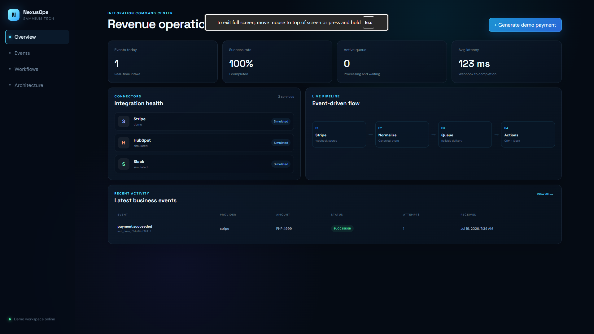
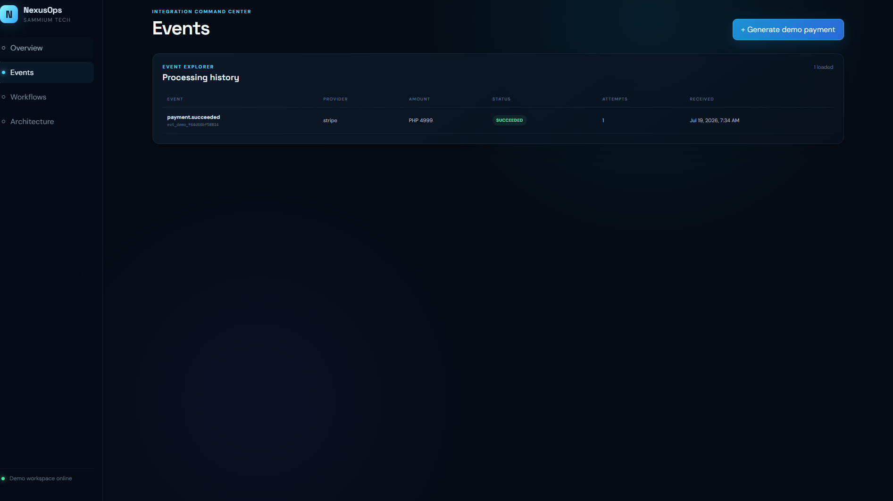
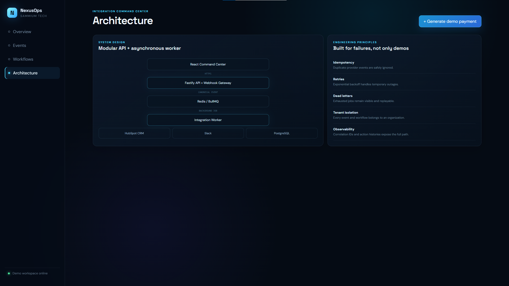
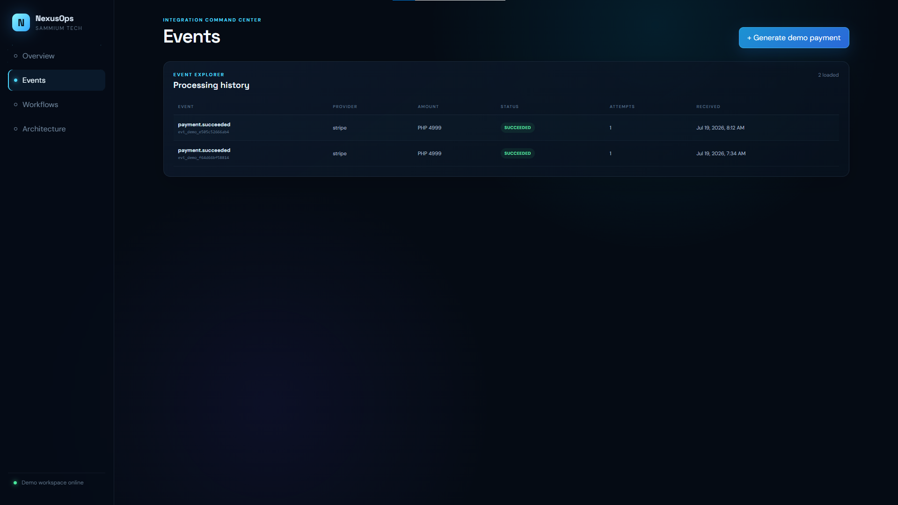

# Sammium NexusOps

**An event-driven business integration platform that connects payment, CRM, and team-notification workflows.**

NexusOps receives Stripe webhooks, validates and normalizes provider payloads into a canonical event model, stores every event in PostgreSQL, routes background work through Redis and BullMQ, synchronizes contacts to HubSpot, sends Slack notifications, and exposes the complete processing lifecycle through a React command center.

> The repository runs fully in **demo mode** without third-party credentials. HubSpot and Slack actions are recorded as simulated successes until tokens are added.

## Portfolio highlights

- Provider-neutral canonical event contract
- Real Stripe webhook signature verification when configured
- At-least-once asynchronous processing with BullMQ
- Database idempotency for duplicate webhooks
- Exponential retries and dead-letter status
- Replayable failed events
- Tenant-scoped events and workflows
- HubSpot contact upsert and Slack incoming-webhook delivery
- Action-level execution history and correlation IDs
- OpenAPI and AsyncAPI contracts
- Dockerized PostgreSQL and Redis
- Responsive React operations dashboard
## Project Preview

<table>
  <tr>
    <td width="50%">
      
      <p align="center"><strong>Integration Command Center</strong></p>
    </td>
    <td width="50%">
      
      <p align="center"><strong>Event Processing Details</strong></p>
    </td>
  </tr>
  <tr>
    <td width="50%">
      
      <p align="center"><strong>OpenAPI Documentation</strong></p>
    </td>
    <td width="50%">
      
      <p align="center"><strong>System Architecture</strong></p>
    </td>
  </tr>
</table>

## Architecture

```text
Stripe / Demo Event
        ↓
Fastify Webhook Gateway
        ↓ normalize + persist
PostgreSQL ←→ Redis / BullMQ
                 ↓
        Integration Worker
          ↙            ↘
   HubSpot CRM       Slack
                 ↓
       Action history + status
```

See [`docs/architecture.md`](docs/architecture.md) for Mermaid diagrams and design rationale.

## Quick start

### Prerequisites

- Node.js 22 or later
- npm 10 or later
- Docker Desktop or local PostgreSQL and Redis

### 1. Configure

```bash
cp .env.example .env
npm install
```

### 2. Start infrastructure

```bash
docker compose up -d
```

### 3. Create the database schema

```bash
npm run db:migrate
```

### 4. Start API, worker, and web dashboard

```bash
npm run dev
```

Open:

- Dashboard: `http://localhost:5173`
- API health: `http://localhost:4000/health`
- Interactive API docs: `http://localhost:4000/docs`

Click **Generate demo payment**. The event should progress from `QUEUED` to `PROCESSING` to `SUCCEEDED`, with simulated HubSpot and Slack action results stored in PostgreSQL.

## One-command container demo

```bash
docker compose -f compose.full.yaml up --build
```

Then open `http://localhost:8080`.

## Configure real integrations

### Stripe test mode

Set:

```env
STRIPE_SECRET_KEY=sk_test_...
STRIPE_WEBHOOK_SECRET=whsec_...
```

Forward Stripe CLI test events to:

```text
http://localhost:4000/webhooks/stripe
```

The endpoint verifies the Stripe signature before accepting the raw event.

### HubSpot

Create a HubSpot private app with CRM contact read/write scopes and set:

```env
HUBSPOT_ACCESS_TOKEN=pat-...
```

The default workflow searches by email, updates an existing contact, or creates a new contact.

### Slack

Create an incoming webhook and set:

```env
SLACK_WEBHOOK_URL=https://hooks.slack.com/services/...
```

The worker posts a formatted payment-success notification.

## API examples

Generate an event:

```bash
curl -X POST http://localhost:4000/api/v1/demo/payments \
  -H "content-type: application/json" \
  -H "x-api-key: nexus-demo-key" \
  -H "x-tenant-id: 11111111-1111-4111-8111-111111111111" \
  -d '{"amount":4999,"currency":"PHP","customerName":"Aoki Developer","customerEmail":"aoki@example.com"}'
```

List events:

```bash
curl http://localhost:4000/api/v1/events \
  -H "x-api-key: nexus-demo-key" \
  -H "x-tenant-id: 11111111-1111-4111-8111-111111111111"
```

## Repository map

```text
apps/api       Fastify HTTP API, webhook gateway, persistence, API docs
apps/worker    BullMQ worker, workflow evaluation, provider connectors
apps/web       React command center
packages/contracts  Canonical event and workflow schemas
docs           OpenAPI, AsyncAPI, diagrams, threat model, ADRs
```

## Reliability behavior

1. An external event ID is unique within a tenant and provider.
2. Duplicate webhooks return the existing event without queuing duplicate work.
3. Jobs receive five attempts with exponential backoff.
4. Each workflow action is stored with input, output, attempt, and error.
5. Exhausted jobs are marked `DEAD_LETTER` and copied to a dead-letter queue.
6. The dashboard can replay failed events after the cause is corrected.

## Security boundary

The MVP includes API-key protection, tenant-filtered queries, webhook signature verification, validation, and logger redaction. The included [`docs/threat-model.md`](docs/threat-model.md) clearly identifies production work still required: OIDC authentication, RBAC, PostgreSQL row-level security, encrypted per-tenant credentials, secret rotation, and immutable audit storage.

## Suggested portfolio demo

1. Show all three connectors in simulated mode.
2. Generate a payment.
3. Open the canonical event and correlation ID.
4. Explain asynchronous processing and idempotency.
5. Add a real Slack webhook and repeat the demo.
6. Temporarily use an invalid webhook URL to demonstrate retries and dead-letter handling.
7. Correct the URL and replay the event.

## License

MIT — use and adapt this project for your portfolio.

## Windows quick setup

From PowerShell inside the project folder:

```powershell
Set-ExecutionPolicy -Scope Process -ExecutionPolicy Bypass
.\scripts\setup-windows.ps1
npm.cmd run dev
```

If Docker Desktop cannot start, run `wsl --update`, restart Windows, then open Docker Desktop and wait until the engine is running before starting the project.
