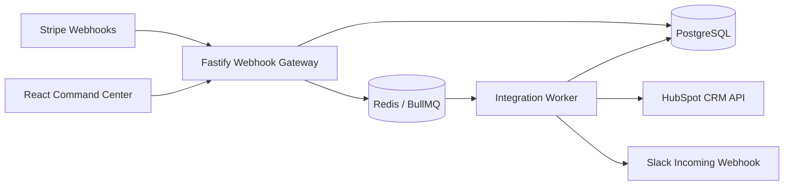
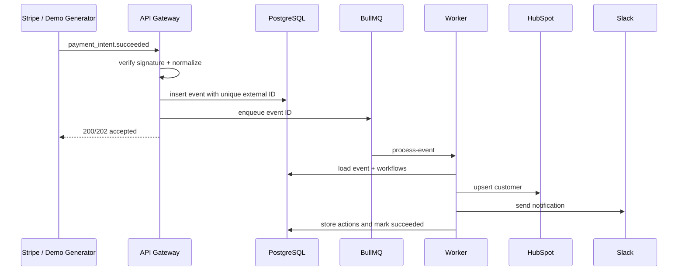

# Architecture

## Context

Sammium NexusOps receives provider events, converts them to a provider-neutral contract, processes them asynchronously, and exposes operational state through a web command center.

## Payment sequence

## Deliberate architectural decisions

- **Modular monolith API:** lower operational complexity than premature microservices.
- **Separate worker process:** isolates slow or unreliable external calls from webhook response latency.
- **Canonical event model:** provider-specific payloads do not leak into workflow logic.
- **At-least-once processing:** duplicates are expected and neutralized through database idempotency.
- **PostgreSQL as system of record:** the queue accelerates processing, while durable business state remains queryable.
